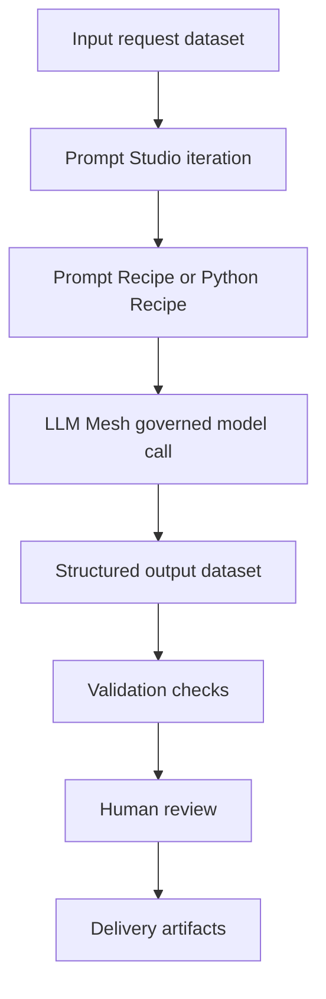

# Dataiku / LLM Mesh Pattern

This is a generic implementation pattern for a governed AI-enabled SDLC workflow.

## Conceptual flow

## Where Dataiku fits

- **Prompt Studio:** prototype and compare prompts.
- **Prompt Recipes:** generate structured outputs across many records.
- **Python Recipes:** validate JSON, apply deterministic rules, format outputs.
- **LLM Mesh:** provide governed access to approved LLMs.
- **Knowledge / RAG:** add approved context such as glossaries, data catalogs, or delivery standards.
- **Evaluation:** test output quality, consistency, and safety.

## Governance principles

- Use approved model connections.
- Avoid sensitive data in prompts unless approved.
- Validate structured outputs.
- Keep humans in the loop for finance, billing, compliance, or customer-impacting workflows.
